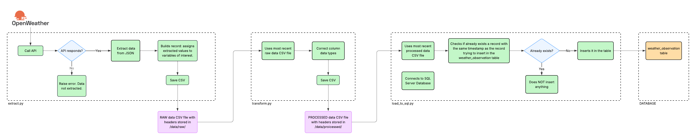

# Culiacan Weather Data Pipeline (Jr Data Engineering Project)

This project builds a small end-to-end weather data ETL pipeline using the OpenWeather API, Python, Pandas and SQL Server.

The goal of this project is to simulate a real Data Engineering workflow: extract → store raw snapshots → transform → load into a database for analytical usage.

## Architecture (ETL)
| Step | Script | Description |
|:---:|:---:|---|
| Extract | src/extract.py | Calls OpenWeather API, builds a normalized record, and stores a CSV snapshot in /data/raw/ |
| Transform | src/transform.py | Converts data types, normalizes formats, and outputs a clean CSV in /data/processed/ |
| Load | src/load_to_sql.py | Loads the processed CSV into SQL Server (table: weather_observation) avoiding duplicates |

Each of the steps of the process is stored in a Python script, as the previous table describes.

## Execution
There are two ways of executing the entire process:
- Run each script separately in order.
- Run the script "main_pipeline.py", which automatically executes the three other. This way there's necessary only one execution for the entire process to run entirely.

NOTE: If willing to execute, make sure not to alter the folder structure, since the scripts are written considering that specific structure.

## The following visual displays a more-detailed representation of the entire process so it can be more understandable.

## Example result
The following image displays all the database records after executing the entire process a couple of times at different hours and days.

